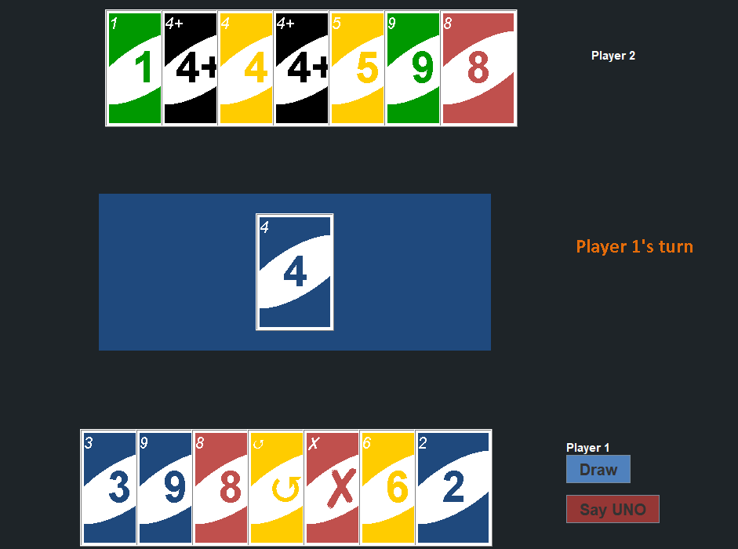
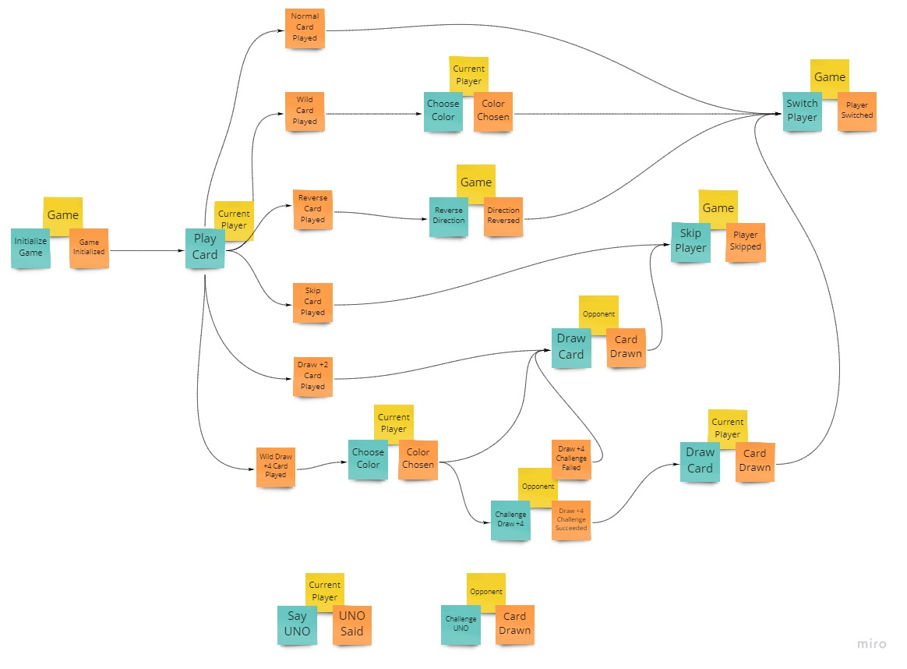
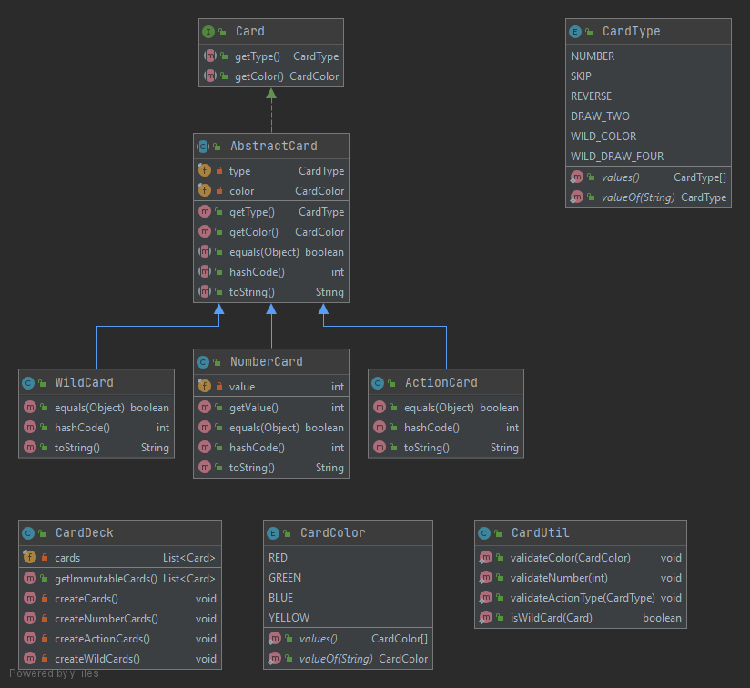
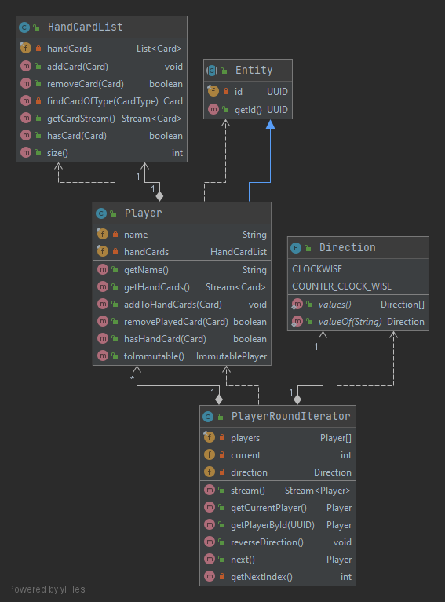
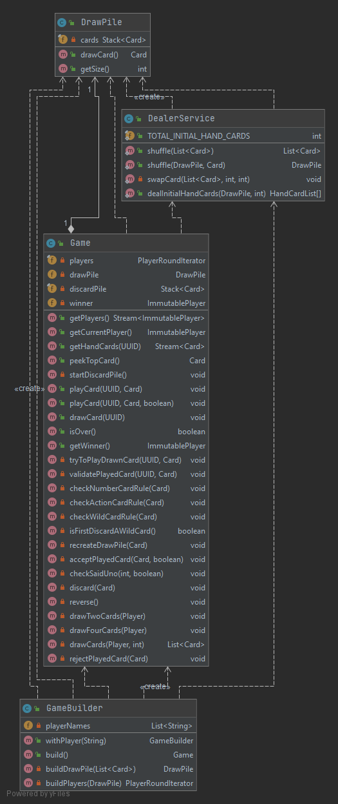
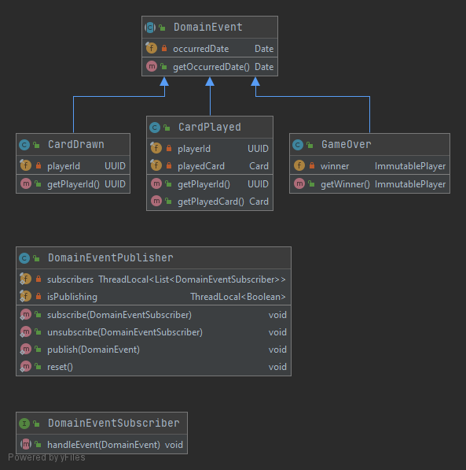

# UNO - Card Game
[](https://sonarcloud.io/dashboard?id=tk-codes_uno)
[](https://sonarcloud.io/dashboard?id=tk-codes_uno)

> v2.0: Rebuilt the core game logic in domain-driven-design.


*Note: GUI is built merely to try out the core domain logic. It is not suitable for serious game. :)*

## Instructions

**Run Application**

Run the `main` method in the UnoApp class or use the following command in the terminal:

```
./gradlew run
```

**Run Unit Tests**

```
./gradlew test
```

## Event Storming

.

## Core Domain

The core game logic is built according to [official uno rules](https://en.wikipedia.org/wiki/Uno_(card_game)#Official_rules).

### Uno Card

Cards are value objects, i.e. immutable. The following card types are available in Uno: 
* Number Card
* Skip Action Card
* Reverse Action Card
* Draw Two Action Card
* Wild Color Card
* Wild Draw Four Card

Initially wild cards don't have a color. When drawn, a new value object is created with the chosen color. 



### Player

`Player` is an entity which contains a list of hand cards to play.

`PlayerRoundIterator` manages the players and switches turn as if the players are in a round table.



### Game

`Game` is the aggregate which maintains the state of **players**, **draw pile** and **discard pile** as the cards are played. 



### Domain Events

`Game` aggregate produces domain events using `DomainEventPublisher`.

Subscribers can register for these events and handle them accordingly. 

